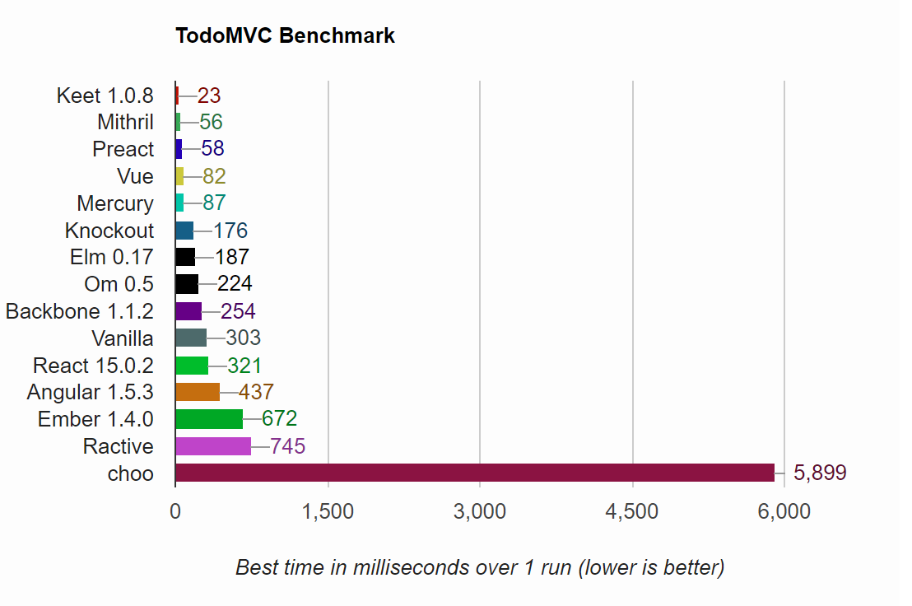

# TodoMVC Performance Benchmark



_(Results for Chrome 63 + Windows 10 on Dell OptiPlex 5040)_

# Try
https://developit.github.io/preact-perf

# Setup
```
npm run install
```
# Develop
```
npm run start
```
# TODO
- [ ] Collect client info.
- [ ] Average test.
- [ ] Size comparison.
- [ ] Add more framework.
- [ ] DRY test.
- [ ] Better UI/UX.
