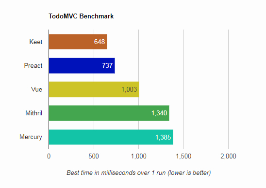

# TodoMVC Performance Benchmark



_( Results from Chrome v64 on Window 7 - AMD FX6100 - Radeon HD 7900 - )_

> 1000 Todos, all test without write to localStorage. Result varied across multiple test

# Setup
```
npm run install
```
# Develop
```
npm run start
```
# TODO
- [ ] Collect client info.
- [ ] Average test.
- [ ] Size comparison.
- [ ] Add more framework.
- [ ] DRY test.
- [ ] Better UI/UX.
